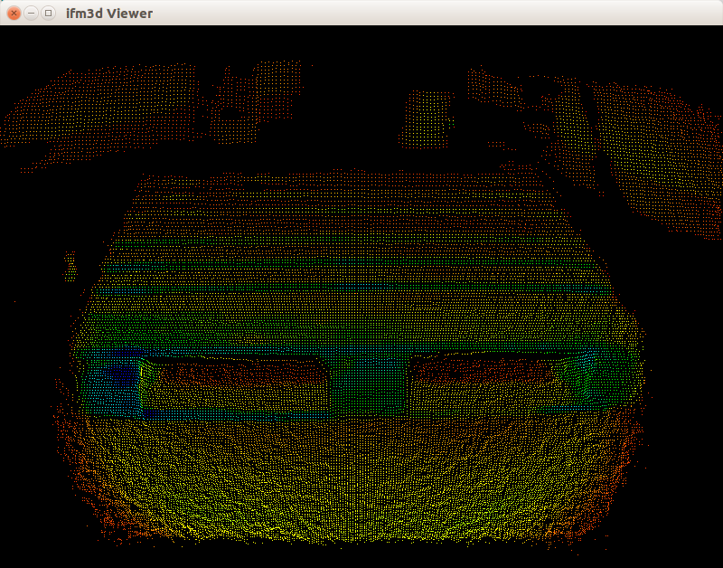

ifm3d
=====
Library and utilities for working with ifm pmd-based 3D ToF Cameras.




Software Compatibility Matrix
-----------------------------
<table>
  <tr>
    <th>ifm3d version</th>
    <th>O3D Firmware Version</th>
    <th>O3X Firmware Version</th>
    <th>Ubuntu Linux Version</th>
    <th>Notes</th>
  </tr>
  <tr>
    <td>0.1.0</td>
    <td>1.6.2114</td>
    <td>0.1.4</td>
    <td>16.04</td>
    <td>Initial (beta) release</td>
  </tr>
  <tr>
    <td>0.2.0</td>
    <td>1.6.2114</td>
    <td>0.1.16, 0.1.20</td>
    <td>14.04, 16.04</td>
    <td>Software triggering (O3X), support for Ubuntu 14.04</td>
  </tr>
  <tr>
    <td>0.3.0</td>
    <td>1.6.2114</td>
    <td>0.1.20</td>
    <td>14.04, 16.04</td>
    <td>Parsing extrinsics (O3D), NTP support (O3X), Simple GUI</td>
  </tr>
  <tr>
    <td>0.3.1</td>
    <td>1.6.2114</td>
    <td>0.1.20</td>
    <td>14.04, 16.04</td>
    <td>Fixed 14.04 regression (std::put_time)</td>
  </tr>
  <tr>
    <td>0.3.2</td>
    <td>1.6.2114</td>
    <td>0.1.20</td>
    <td>14.04, 16.04</td>
    <td>Patch to tools module build script</td>
  </tr>
  <tr>
    <td>0.3.3</td>
    <td>1.6.2114</td>
    <td>0.1.20</td>
    <td>14.04, 16.04</td>
    <td>Windows build support</td>
  </tr>
  <tr>
    <td>0.4.0</td>
    <td>1.6.2114</td>
    <td>0.1.20</td>
    <td>14.04, 16.04</td>
    <td>Added bash completions for ifm3d command line tool</td>
  </tr>
  <tr>
    <td>0.5.0</td>
    <td>1.6.2114</td>
    <td>0.1.20</td>
    <td>14.04, 16.04</td>
    <td>Added firmware flashing to ifm3d command line, Windows support for
    image module</td>
  </tr>
  <tr>
    <td>0.6.0</td>
    <td>1.6.2114</td>
    <td>1.0.62</td>
    <td>14.04, 16.04</td>
    <td>Added pcic client, ability to dump camera trace logs</td>
  </tr>
  <tr>
    <td>0.7.0</td>
    <td>1.6.2114, 1.20.973</td>
    <td>1.0.62</td>
    <td>14.04, 16.04</td>
    <td>Timestamping of image buffers, host/device time sync for O3D, changing
    application parameters on-the-fly</td>
  </tr>
  <tr>
    <td>0.8.1</td>
    <td>1.6.2114, 1.20.973</td>
    <td>1.0.62</td>
    <td>14.04, 16.04</td>
    <td>Register illumination temperature to frame data</td>
  </tr>
</table>

**NOTE**: Our *officially supported platform* is Ubuntu Linux. However, other
  operating systems will likely be acceptable, especially other Debian-based
  Linuxes. We also note that, WRT Ubuntu Linux, our current plan is to support
  the two most recent LTS releases. So, for example, as of this writing, we
  currently support 16.04 (preferred) and 14.04. Once 18.04 is released, we
  will drop support for 14.04 and only be supporting 18.04 and 16.04. If you
  are using this library embedded in a product, you should plan accordingly.

Organization of the Software
----------------------------
The ifm3d software is organized into modules, they are:

|Module Name|Description|
|-----------|-----------|
|[Camera](modules/camera)|Provides an implementation of the XMLRPC protocol for configuring the camera and PMD imager settings.|
|[Framegrabber](modules/framegrabber)|Provides an implementation of the PCIC protocol for streaming pixel data and triggered image acquisition.|
|[Image](modules/image)|Provides a bridge from raw camera bytes to OpenCV and PCL image encodings.|
|[Tools](modules/tools)|Provides the ifm3d command line tool for manipulating and introspecting the hardware interactively. It is also suitable for usage within shell scripts.|
|[Examples](modules/examples)|Provides examples how to use the ifm3d library.|

Installing the Software
-----------------------

### Build Dependencies

Building the software from source, requires the following pre-requisites
installed on your machine:

* [Boost](http://www.boost.org)
* [Gtest](https://github.com/google/googletest)
* [Glog](https://github.com/google/glog)
* [libxmlrpc](http://xmlrpc-c.sourceforge.net/)
* [CMake](http://www.cmake.org)
* [OpenCV](http://opencv.org)
* [PCL](http://pointclouds.org)

Additionally, if you plan to build the debian packages and have the
dependencies computed for you dynamically (see the note below on the
`repackage` target), you will also need:

* [Python 2.7](https://www.python.org/)
* [readelf](https://www.gnu.org/software/binutils/) (Part of the `binutils` package)
* [dpkg](https://help.ubuntu.com/lts/serverguide/dpkg.html)

We note that, if you are running on a supported Linux, all of these packages
are available through the offical debian repositories and should be a simple
`apt-get` away from being installed on your machine.

### Building From Source

Building the software follows the usual cmake idiom of:

```
$ mkdir build
$ cd build
$ cmake -DCMAKE_INSTALL_PREFIX=/usr ..
$ make
$ make check
$ sudo make install
```

Alternatively, if you are on a supported Linux platform (see above), the
preferred method of building and installing the software is:

```
$ mkdir build
$ cd build
$ cmake -DCMAKE_INSTALL_PREFIX=/usr ..
$ make
$ make check
$ make package
$ make repackage
$ sudo dpkg -i ifm3d_0.2.0_amd64-camera.deb
$ sudo dpkg -i ifm3d_0.2.0_amd64-framegrabber.deb
$ sudo dpkg -i ifm3d_0.2.0_amd64-image.deb
$ sudo dpkg -i ifm3d_0.2.0_amd64-tools.deb
```
(The version number embedded in the deb file will be dependent upon which
version of the `ifm3d` software you are building)

A few important notes when building from source:

* For the `make check` step, you will need to have your camera plugged in. The
  cameras settings will get mutated by this process, so, you are encouraged to
  back up your configuration if you'd like to later restore your camera to its
  pre-testing state. You are also encouraged to test against the camera (or
  cameras) you plan to use. I.e., O3D, O3X, etc. Please note that testing
  against the O3X will fail unless you have at least version 0.1.16 of the ifm
  firmware installed on the device.

* Many `ifm3d` users ultimately plan to use this library along with its
  associated [ROS wrapper](https://github.com/lovepark/ifm3d-ros). If this is
  the case, you need to be sure that the version of OpenCV that you link to in
  both `ifm3d` and `ifm3d-ros` are consistent. To give you some control over
  that, the build process allows you to explicitly call out which version of
  OpenCV you wish to use. For example, if you are on 14.04 and using ROS
  Indigo, your `cmake` line above should look something like: `$ cmake
  -DCMAKE_INSTALL_PREFIX=/usr -DFORCE_OPENCV2=ON ..`. Similarly, if you are on
  16.04 and ROS Kinetic, your `cmake` line above should look something like: `$ cmake
  -DCMAKE_INSTALL_PREFIX=/usr -DFORCE_OPENCV3=ON ..`

* Experienced users may be puzzled by the `repackage` step. If you are simply
  building for your local machine, you can skip it (albeit, with minimal
  risk). This step is used to dynamically compute the debian dependencies for
  the particular module. Due to how we are partitioning out the software, this
  approach is necessary vs. the more traditional
  `CPACK_DEBIAN_PACKAGE_SHLIBDEPS` wrapper around `dpkg-shlibdeps`. We
  basically created [a version of that tool](cmake/utils/ifm3d-dpkg-deps.py.in)
  that exploits *a-priori* information about the `ifm3d` environment to
  properly compute the debian dependencies. If you are building debs on a build
  machine to be distributed out to various runtime computers, you will
  certainly want to exectue the `repackage` target so that you are ensured the
  runtime machines have the proper dependency chain in place.


Basic Library Usage
-------------------
A set of example programs for using the library are forthcoming. In the
meantime, please refer to
[the image module unit tests](modules/image/test/ifm3d-image-tests.cpp) for
concrete examples of library usage. We think you will find those instructive
and will enable you to get started quickly with the software.


Configuring Your Camera
-----------------------
(For exemplary purposes, we assume an O3X camera)

The central command-line tool provided with the library is the
appropriately-named binary program `ifm3d`.

To view your current camera settings, you can run the following command:
```
$ ifm3d dump
{
  "ifm3d": {
    "Apps": [
      {
        "Description": "",
        "Id": "1299148885",
        "Imager": {
          "ExposureTime": "1000",
          "FrameRate": "5",
          "MaxAllowedFrameRate": "12.5",
          "MinimumAmplitude": "42",
          "SpatialFilter": {},
          "SpatialFilterType": "0",
          "SymmetryThreshold": "0.4",
          "TemporalFilter": {},
          "TemporalFilterType": "0",
          "Type": "1FRQ_1EXP_0GRAY"
        },
        "Index": "1",
        "Name": "",
        "OutputAmplitudeImage": "true",
        "OutputConfidenceImage": "true",
        "OutputDistanceImage": "true",
        "OutputGrayscaleImage": "false",
        "OutputXYZImage": "true",
        "TriggerMode": "1",
        "Type": "Camera"
      }
    ],
    "Device": {
      "ArticleNumber": "",
      "ArticleStatus": "??",
      "Description": "",
      "DeviceType": "1:512",
      "IPAddressConfig": "0",
      "ImageTimestampReference": "1489579229",
      "Name": "New sensor",
      "OperatingMode": "0",
      "PasswordActivated": "false",
      "SessionTimeout": "30",
      "UpTime": "1.59972222222222"
    },
    "Net": {
      "MACAddress": "00:02:01:40:54:09",
      "NetworkSpeed": "0",
      "StaticIPv4Address": "192.168.0.69",
      "StaticIPv4Gateway": "192.168.0.201",
      "StaticIPv4SubNetMask": "255.255.255.0",
      "UseDHCP": "false"
    },
    "_": {
      "Date": "Tue Mar 28 21:16:07 2017",
      "HWInfo": {
        "MACAddress": "00:02:01:40:54:09",
        "Mainboard": "#!03_M100_B01_12345678_008025483",
        "MiraSerial": "Not implemented"
      },
      "SWVersion": {
        "Algorithm_Version": "0.1.3",
        "Calibration_Device": "00:02:01:40:54:09",
        "Calibration_Version": "0.0.1",
        "ELDK": "GOLDENEYE_YOCTO_HARDFP-273-06d9c894636352a6c93711c7284d02b0c794a527",
        "IFM_Software": "0.1.4",
        "Linux": "Linux version 3.14.34-rt31-yocto-standard-00016-g5121435-dirty (jenkins@dettlx152) (gcc version 4.9.2 (GCC) ) #1 SMP PREEMPT RT Tue Mar 14 08:40:14 CET 2017",
        "Main_Application": "0.4.986"
      },
      "ifm3d_version": 100
    }
  }
}
```

Redirecting the above serialized json to a file would allow you to edit camera
parameters. Let's say you saved that data to a file called `o3x.json` and made
some modifications. To commit those changes to the hardware, you would:

    $ ifm3d config < o3x.json

You could also just edit a single parameter quite easily from the command
line. Referring to our dump above where the camera is set to stream data at 5
Hz, if we wanted to step the frame rate up to 10 Hz, you could:

    $ echo '{"Apps":[{"Index":"1","Imager":{"FrameRate":"10"}}]}' | ifm3d config

We can see that our setting took affect by dumping the camera configuration
again. This time, we *grep* our output using the handy json filtering tool
[jq](https://stedolan.github.io/jq):

```
$ ifm3d dump | jq .ifm3d.Apps[0].Imager.FrameRate
"10"
```

You can see what else is available via the `ifm3d` tool by running:

```
$ ifm3d --help
ifm3d: version=0.3.0
usage: ifm3d [<global options>] <command> [<args>]

global options:
  -h [ --help ]            Produce this help message and exit
  --ip arg (=192.168.0.69) IP address of the sensor
  --xmlrpc-port arg (=80)  XMLRPC port of the sensor
  --password arg           Password for establishing an edit-session with the
                           sensor


These are common commands used in various situations:

    cp          Create a new application on the sensor,
                bootstrapped from a copy of an existing one.

    config      Configure sensor settings from a JSON description of
                the desired sensor state. See also `dump'.

    dump        Serialize the sensor state to JSON.

    export      Export an application or whole sensor configuration
                into a format compatible with ifm Vision Assistant.

    hz          Compute the actual frequency at which the FrameGrabber
                is running.

    import      Import an application or whole sensor configuration
                that is compatible with ifm Vision Assistant's export
                format.

    ls          Lists the applications currently installed on
                the sensor.

    reboot      Reboot the sensor, potentially into recovery
                mode. Recovery mode is useful for putting the
                sensor into a state where it can be flashed
                with new firmware.

    reset       Reset the sensor to factory defaults.

    rm          Deletes an application from the sensor.

    schema      Construct and analyze image acquisition schema masks.

    time        Get/set the current time on the camera.

    viewer      Stream and view real-time data from the camera.


For bug reports, please see:
https://github.com/lovepark/ifm3d/issues
```

We also note that every sub-command also accepts the `--help` argument. For
example:

```
$ ifm3d reboot --help
usage: ifm3d [<global options>] reboot [<reboot options>]

global options:
  -h [ --help ]            Produce this help message and exit
  --ip arg (=192.168.0.69) IP address of the sensor
  --xmlrpc-port arg (=80)  XMLRPC port of the sensor
  --password arg           Password for establishing an edit-session with the
                           sensor

reboot options:
  -r [ --recovery ]     Reboot into recovery mode
```

Known Issues, Bugs, and our TODO list
-------------------------------------
Please see the [Github Issue Tracker](https://github.com/lovepark/ifm3d/issues).

LICENSE
-------
Please see the file called [LICENSE](LICENSE).


AUTHORS
-------
Tom Panzarella <tom@loveparkrobotics.com>
