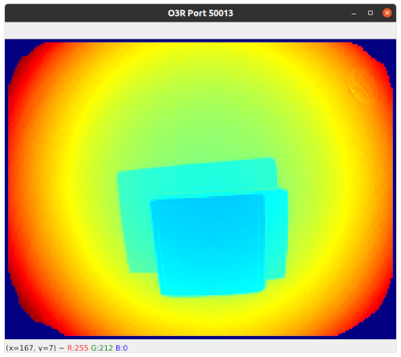

# ifm3d Overview

Library and utilities for working with ifm pmd-based 3D ToF Perception devices. Compatible with the O3R, O3D and O3X platforms. 
This library is available in Python, C++, and has wrappers for ROS and ROS2.  
[C++ API Reference](https://ifm.github.io/ifm3d-docs/html/cpp_api/annotated.html)  
[Python API Reference](https://ifm.github.io/ifm3d-docs/html/_autosummary/ifm3dpy.html#module-ifm3dpy)  
Comprehensive documentation is available on [ifm3d.com](https://ifm3d.com/).


/badge.svg?branch=master)
/badge.svg?branch=master)

| 3D cloud | Distance | RGB |
| -- | -- | -- |
|  |  |  |

## Released Versions

⚠️ Note that the `main` branch is generally in a work in progress state and you probably want to use a
tagged [release version](https://github.com/ifm/ifm3d/releases) for production.

⚠️ Note that O3D and O3X support is currently experimental- Use at your own risk!.

For a full compatibility matrix between the ifm3d library, the O3R firmware and the Vision Assistant GUI, please refer to [the compatibility matrix on ifm3d.com](https://ifm3d.com/latest/CompatibilityMatrix/compatibility_matrix.html).

## Supported languages

ifm3d is a C++ based library, with a Python wrapper mirroring the available features. We support the following versions of these two languages:

| Name      | Versions              |
| --------- | --------------------- |
| Python    | 3.8, 3.9, 3.10, 3.11  |
| C++       | GCC 7.5+, MSVC 2019+  |


## Organization of the Software

The ifm3d software is organized into modules, they are:

| Module name | Description |
| ----------- | ----------- |
| `device`      | Provides an implementation of the XMLRPC protocol for configuring the camera and pmd imager settings. |
| `framegrabber` | Provides an implementation of the PCIC protocol for streaming pixel data and triggered image acquisition.|
| `swupdater`  | Provides utilities for managing the `SWUpdate` subsystem of the camera. |
| `pcicclient` | Direct access to PCIC to, for example, actuate digital IO.|
| `tools` | Provides the ifm3d command line tool for manipulating and introspecting the hardware interactively. It is also suitable for usage within shell scripts to, for example, manage fleets of cameras.|
| `pybind11` | Provides Python bindings through <a href="https://github.com/pybind/pybind11">pybind11</a> to the native C++ API. Supports all general camera functionality as well as a zero-copy interface to image data, exposed as NumPy arrays. |
| `deserialize` | Provides definitions and functions for deserializing structs sent over PCIC. |

## Installation instructions
Please refer to the corresponding section on [ifm3d.com](https://ifm3d.com/).

## Supported docker containers
Docker containers are available for the ifm3d library, both on [GHCR](https://github.com/orgs/ifm/packages?repo_name=ifm3d) and on the [dockerhub](https://hub.docker.com/r/ifmrobotics/ifm3d). 
You can pull them with:
```bash
docker pull ghcr.io/ifm/ifm3d:stable
```
OR
```bash
docker pull ifmrobotics/ifm3d:stable
```
Note that we provide 2 tags, *stable* always points to the latest tagged version, and *latest* is built nightly with the latest changes on the main branch. The *latest* tag is typically a work in progress.  
For more details on the available containers, see [here](ifm3d/doc/sphinx/content/installation_instructions/install_docker:Docker%20dev%20container).  
For more details on docker and the O3R platform see [here](documentation/O3R/Docker/README:Docker%20on%20O3R).

## Examples

Examples for the ifm3d library can be found in the [ifm3d-examples](https://github.com/ifm/ifm3d-examples) repository.

## Report a bug and check the known issues

Please see the [GitHub Issue Tracker](https://github.com/ifm/ifm3d/issues), or contact `support.robotics@ifm.com`.

## LICENSE

Please see the [LICENSE](LICENSE) file.
