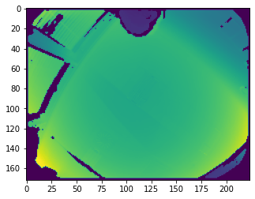

# First steps with ifm3d/ifm3dpy

After installing the ifm3d/ifm3dpy library, you most likely want to receive an image as fast and possible. The next steps will guide you through the process. You will find more information in the [ifm3d API documentation](ifm3d/doc/sphinx/index:ifm3d%20library).

## RUN/CONF/IDLE

**<font color="red"> The default configuration of all heads is "CONF". You cannot receive any images before changing to "RUN".</font>**

To set a head into `"RUN"`, the configuration of the `VPU` needs to be changed. This change needs to be uploaded to the VPU afterwards.

Please refer to the [this section](ifm3d/doc/sphinx/content/examples/o3r/configuration/configuration:How%20to%3A%20configure%20the%20camera) for more information.

Following steps describe the change of the state of a single head.

```python
from ifm3dpy import O3R

o3r = O3R()
config = o3r.get()
config['ports']['port2']['state'] = "RUN" #Expecting a head on Port 2
o3r.set(config)
```

Note: Depending where your imager is connected, `'port2'` might not work.

## Receive an image

If the head is in `"RUN"`, it is possible to receive images.

Please refer to [this section](ifm3d/doc/sphinx/content/examples/o3r/getting_data/getting_data:How%20to%3A%20receive%20an%20image) for more information.

To display the image directly, we use `matplotlib`.

```python
from ifm3dpy import O3R, FrameGrabber, buffer_id
import matplotlib.pyplot as plt

o3r = O3R()
fg = FrameGrabber(o3r, pcic_port=50012) #Expecting a head on Port 2 (Port 2 == 50012)

# Set schema and start Grabber
fg.start([buffer_id.NORM_AMPLITUDE_IMAGE,buffer_id.RADIAL_DISTANCE_IMAGE,buffer_id.XYZ])

# Get a frame
[ok, frame] = fg.wait_for_frame().wait_for(500)
plt.imshow(frame.get_buffer(buffer_id.RADIAL_DISTANCE_IMAGE))

plt.show()
```


